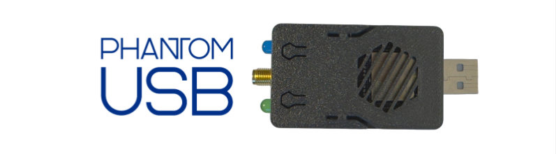

<h1 align="center">PhantomUSB 🔮</h1>
<h3 align="center">The Open-Source Keystroke Injection Device for Pentesters</h3>

<p align="center">
  
  
   
</p>

## PhantomUSB
**PhantomUSB** is a **WiFi-enabled keystroke injection device** with a built-in scripting engine and a dual LED status system. Powered by an **ESP32 Wroom32U** and **CH9329**, it enables seamless, remote-controlled automation of keyboard inputs over a secure WiFi AP. With **low-latency execution**, **plug & play setup**, and an intuitive **web interface**, PhantomUSB is designed for professionals who require precision, flexibility, and efficiency in automated keystroke execution.

## ✨ Features
- 📡 **Remote Keystroke Injection** via Web Interface (WiFi Access Point)
- 💡 **Dual LED Status System** (Operation Feedback)
- 📜 **Embedded Scripting Language** ([Documentation](https://learn.axionsec.pro/PhantomUSB/Phantom))
- ⚡  **Low-latency Communication** with CH9329
- 🛠️ **Plug & Play Setup** with ESP32 Wroom32U & CH9329
- 🔒 **Secure Connection** (WPA2 Protected)
- 📚 **Open Source** (Fully Customizable)
- 📱 **Cross-Platform Compatibility** (Windows, Linux, Mac)
- 🚀 **Easy Flashing** using Web Flasher ([Web Flasher](https://flash.axionsec.pro/))
- 📖 **Detailed Documentation** ([Learn](https://learn.axionsec.pro/PhantomUSB/Phantom))
- 💸 **Cheap & Affordable** (DIY Components ~ $11.24)

---

## 🛠 Hardware Setup

### 🔌 Pinout Diagram

| ESP32 Wroom32U | CH9329 | LEDs       |
|----------------|--------|------------|
| GND            | GND    |            |
| VIN (5V)       | 5V     |            |
| GPIO 17        | TX     |            |
| GPIO 16        | RX     |            |
| GPIO 19        |        | LED Write  |
| GPIO 18        |        | LED Status |

**LED Behavior:**
- 💚 **Write LED (GPIO 18):** Blinks during script execution
- 💙 **Status LED (GPIO 19):** Solid = CH9329 Active and ready 

---

### 📦 Components
| Component                       | Quantity | Price   | Source      |
|---------------------------------|----------|---------|-------------|
| ESP32 Wroom32U                  | 1        | ~ $5    | AliExpress  |
| CH9329                          | 1        | ~ $1.85 | AliExpress  |
| LEDs (Blue and Green)           | 2        | ~ $1.59 | AliExpress  |
| Jumper Wires (10cm)             | 1        | ~ $1.30 | AliExpress  |
| IPEX to SMA Pigtail Antenna Set | 1        | ~ $1.50 | AliExpress  |
- Total Cost: **$11.24** (Excluding Shipping)
- ~ = Approximate Price
- **Note:** Prices may vary based on the seller and location.
- **Soldiering is not required when using jumper wires.**
- 🧩 **No Soldering Needed** - Jumper wire compatible
---

### 🔧 Setup Guide


1. Glue the CH9329 to the back of the ESP32 (bottom side).
2. Connect the CH9329 to the ESP32 using small jumper wires.
3. Make sure everything fits well without parts sticking out.
4. Connect the LEDs to the ESP32 (soldering is best for a strong connection).
5. 3D Print ([3mf File](/PhantomUSB%20Case.3mf)) or make a DIY case for the Phantom USB.

---

## 📶 WiFi Credentials

```ini
IP: 192.168.4.1
SSID: "PhantomUSB"
Password: "12345678910"
```

---

## 📜 Scripting Language Documentation

**Full Documentation:**  
[https://learn.axionsec.pro/PhantomUSB/Phantom](https://learn.axionsec.pro/PhantomUSB/Phantom)

**Basic Commands:**
- ⌨️ `write "text"` - Type text with keyboard emulation
- ⏎ `writeLn "text"` - Type text + press Enter
- ⏳ `delay "ms"` - Pause execution (milliseconds)

**Advanced Features:**
- 🖥️ `terminal "OS"` - Auto-open system terminal (Windows/Linux/Mac)
- 🔢 `key "F1-F24"` - Press any key
- 🧭 `arrowKey "direction"` - Navigate with arrow keys
- 🤖 `comboKey "key1+key2"` - Press multiple keys simultaneously